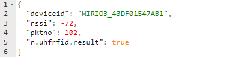
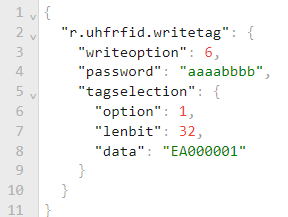

# *TU-04-C04 Multi-Channel RFID Reader Communication Specification*

# <a name="_toc83063359"></a>Contents
1. [The Device Peripheral – RFID Reader](#_toc167379807)

    1. [RFID Reader Peripheral](#_toc167379808)

        - [Attribute](#_toc167379809)

        - [Telematics Data](#_toc167379810)

        - [RPC Call and Response](#_toc167379811)

        - [RFID Tag Memory Map Layout](#_toc167379812)

    2. [Tag Selection/Singulation](#_toc167379813)

        - [Example](#_toc167379814)

    3. [Tag Locking and Tag Password](#_toc167379815)

        - [Gen2 Tag Passwords](#_toc167379816)

        - [Lock Mask and Lock Action](#_toc167379817)

        - [Tag Locking State Chart](#_toc167379818)

        - [Tag Locking process](#_toc167379819)

    4. [Tag Reading Process](#_toc167379820)

    5. [Tag Reading/Writing Return Code](#_toc167379821)

2. [The Device Peripheral – Output Port](#_toc167379822)

    1. [Output Port Peripheral](#_toc167379823)

        - [Attribute](#_toc167379824)

        - [Telematics Data](#_toc167379825)

        - [RPC Call and Response](#_toc167379826)

3. [The Device Peripheral – Input Port](#_toc167379827)

    1. [Input Port Peripheral](#_toc167379828)

        - [Attribute](#_toc167379829)

        - [Telematics Data](#_toc167379830)

        - [RPC Call and Response](#_toc167379831)


# <a name="_toc167379807"></a>The Device Peripheral – RFID Reader
## <a name="_toc167379808"></a>RFID Reader Peripheral

|***Key***|**Value**|
| -: | :- |
|*keycmd*|uhfrfid|
|*feature*|NA|

### <a name="_toc167379809"></a>Attribute
#### *Device Only Attribute*

|***Key***|**Value Type**|**Description**|
| -: | :- | :- |
|*d.uhfrfid.ch*|Integer|Indicate number of available RFID Channel|
|*d.uhfrfid.pwrmax*|Integer|Maximum reader power in dBm|
|*d.uhfrfid.pwrmin*|Integer|Minimum reader power in dBm|
|*d.uhfrfid.csmax*|Integer|Maximum Tag Cache Memory size (in number of tag)|
|*d.uhfrfid.antstate*|Array of Boolean|Each element indicates if the antenna channel is detected connect to external antenna.Eg. [true,false,true,true], indicate that Antenna Channel 1,3,4 is connected with antenna and channel 2 is NOT connected with antenna. |
|*d.uhfrfid.antison*|Array of Boolean|Each element indicated if the antenna output channel is ON (true) or OFF (false).Eg. [true,false,true,true], indicate that Antenna Output Channel 1,3,4 is ON and channel 2 OFF.|
|*d.uhfrfid.temp*|Integer|RFID reader internal temperature in degree Celsius.Temperature must not exceed 85°C. Once it reached 85°C, it will force the reader to stop the tag detection to prevent system from overheating.|
|*d.uhfrfid.readerver*|String|Internal RFID Reader Module Firmware ID|


#### *Share Attribute*
The function of the Share Attribute can be categories as below,

- Tag Inventory and Cache Setting 
- Tag Reading Mode Setting
- Reader Setting
- Demo and Testing
#### *Tag Inventory and Cache Setting*
Configuration of the reading behavior, timing and triggering during tag inventory process.

|***Key***|**Value Type**|**Description**|
| -: | :- | :- |
|*s.uhfrfid.devreadperiod*|Integer|Period in millisecond for the device to read for the tag in the multi tag reading loop. Once the tag reading is started, within the period, the reading process cannot be interrupted. The device will only return after finished the period. The setting range is 500ms to 10000ms.|
|*s.uhfrfid.auto*|Boolean|False : Will only start Tag Inventory/Reading upon request (r. uhfrfid.start=true) and stop when reach s.uhfrfid.periodTrue : Will continue Tag Inventory/Reading when r.uhfrfid.start=true and stop when r.uhfrfid.start=false.Please noted if it is set to True, the reader will start the Tag Inventory/Reading process immediately after the system is power up.|
|*s.uhfrfid.period*|Integer|Reading period in second when s. uhfrfid.auto=false.Value: 5sec ~ 300sec|
|*s.uhfrfid.inptrig*|Boolean Array|Enable(True) or Disable(False) Input trigger from on board input port to start the Tag reading/inventory process when the s.uhfrfid.auto=false.E.g. “s.uhfrfid.inptrig” : [true,false] with enable input port#0 to start the Tag reading/inventory process.|
|*s.uhfrfid.cachetagremove*|Boolean|If true, will auto remove the tag from the cache memory after the period given by s.uhfrfid.cacheperiod.If false, the tag data will still in the cache memory until the tag inventory process is stop by calling r.uhfrfid.start=false or the reader stop when reading period is over during s.uhfrfid.auto=false.No more new tag will be added into the cache once the cache memory is full.|
|*s.uhfrfid.cacheperiod*|Integer|Period for the detected tag to be stay in the Tag Cache Memory before remove it from the cache. After a tag is detected, if the tag is still staying in the reader reading range, the same tag will be re-detected again. As long as the re-detected period is less than the cache period, the tag will not be removed from the cache. The system will only update the tag info in the Telematics topic when the tag detected is newly detected and not already available in the Tag Cache Memory. Value provided is millisecond.Value=500ms to 60000msThis setting only valid if s.uhfrfid.cachetagremove=true.|
|*s.uhfrfid.tagremoveupd*|Boolean|When set to True, it will send out the tag information when the tag is no more detected and remove from the cache memory.|
|*s.uhfrfid.antchangeupd*|Boolean|Enable(true)/Disable(false).When enabled, it will send out the detected tag in Telematics if the tag is reading from different antenna channel.If it is disable, it will only send out the detected tag info ONCE when it is detected irrespective of the of the antenna channel.|
|*s.uhfrfid.enbforceupd*|Boolean|When set to true, the system will send out the tag info that currently in the cache memory. The period is depend on the setting in s.uhfrfid.forceupdperiod|
|*s.uhfrfid.forceupdperiod*|Integer|Range 3~100Second = period in force update tag info in the cache memory. Only valid if s.uhfrfid.enbforceupd=true.|


#### *Tag Selection/Singulation Filter Criteria*
While the system is reading/inventory the surround tag, the system is able to filter off the unwanted tag and only read the tag that matching the selection filter criteria.

|***Key***|**Value Type**|**Description**|
| -: | :- | :- |
|*s.uhfrfid.selfilteroption*|Integer 0~4|Tag Selection mode.0 = Disable Tag Selection Filter (Any surrounding detected tag will be selected, rest of the key not required)1 = Tag Selection Filter with Tag EPC. (key “s.uhfrfid.selfilteraddr” is not used)2 = Tag Selection Filter with data in TID Memory Bank3 = Tag Selection Filter with data in USER Memory Bank4 = Tag Selection Filter with data in EPC Memory Bank|
|*s.uhfrfid.selfilteraddr*|32bit Hex String|Define the starting bit address in the Tag Memory to compare with the s.uhfrfid.selfileterdata. If bit address is 0x20, it will have value “20”.Please refer to RFID Tag Memory Map Layout. |
|*s.uhfrfid.selfilterlenbit*|Integer|Specified number of BIT to compare/match during tag filter selection|
|*s.uhfrfid.selfilterdata*|String of Hex Byte, Max 64byte|Define the data to be compared against the data in the Tag memory. The system will start to match/compare from the MSB bit for the first byte and total bit to compare is according to s.uhfrfid.selfilterlenbit.|
|*s.ufhrfid.selfilterinvert*|Boolean|If set to True, it will select the Tag that **NOT** matching the tag selection filter criteria.|

For more information on the Tag Selection/Singulation filter criteria, please refer to section “Tag Selection Filter”.
#### *Auto Tag Data Reading*
While the system is inventory /reading the surround tag, the system is able to read one of the memory banks in the tag to allow fast acquiring of the tag data. 

|***Key***|**Value Type**|**Description**|
| -: | :- | :- |
|*s.uhfrfid.enbtagdata*|Boolean|Enable Tag Data reading during Inventory process. When enabled, the system will auto read the data from one of the memory bank (RESERVED, EPC, TID, USER).|
|*s.uhfrfid.tagdatamembank*|Integer 0~3|Part of Enable Tag Data Reading Setting. Specified the memory bank to be read,0 = RESERVED1 = EPC2 = TID3 = USER|
|*s.uhfrfid.tagdatareadaddr*|32bit Hex String|Part of Enable Tag Data Reading Setting. Set the start address (16bit addressing) of the tag memory to read. Eg. If Bit Address of the Tag Memory is 0x20, the s.uhfrfid.tagdatareadaddr will be set to “2”. |
|*s.uhfrfid.tagdatawordcount*|Integer 1~96|Part of Enable Tag Data Reading Setting. Set the total number of words (16bit) to read.|
|*s.uhfrfid.enbtagpass*|Boolean|Enable(true)/Disable(false) Tag password during tag inventory|
|*s.uhfrfid.tagpass*|32Bit Hex  String|32Bit Tag password in Hex String.Eg. “ff2d2050” will have 0xff,0x2d,0x20,0x50 as tag password.|

When turning on the tag data reading, if the tag is lock with password, the s.uhfrfid.enbtagpass must be set to True with s.uhfrfid.tagpass having the tag password.

If the tag data is read successfully, it will return together with other tag information in the Telematics Data with the key “tagdata”. Please refer to the Telematics Data section t.uhfrfid.param for more information.
#### *Tag Reading Mode Setting*
Various reader reading tuning values are available to allow fast reading of the surrounding tag according to the various environment condition and application requirement.

|***Key***|**Value Type**|**Description**|
| -: | :- | :- |
|*s.uhfrfid.dynamicq*|Boolean|When true(1), the Q factor is set to Dynamic Q and the s.uhfrfid.q setting will be ignore|
|*s.uhfrfid.q*|Integer|Tag Query Q factor 0~16 (default = 4), Higher Q value suitable high tag density detection but with slower return respond.If the factor is -1, the Dynamic Q factor is enabled.|
|*s.uhfrfid.semode*|Integer|Set the Tag Query Session mode to S0~S3 Value: 0 to 3|
|*s.uhfrfid.target*|Integer 0~3|0 = Target A. Read ‘A’ tag and move it to state ‘B’.1 = Target B. Read ‘B’ tag and move it to state ‘A’.2 =Target A-B. Reads ‘A’ tags one at a time and moves them into the ‘B’. Once no more tag found, start to beads ‘B’ tags one at a time and moves them into the ‘A’ state. The process with repeat again and again.3 = Target B-A. Same as Target A-B but in reverse order.|
|*s.uhfrfid.epcextended*|Boolean|Enable(true)/Disable(false) EPC Extended Info.When enabled, the tag ID provided in the Telematics will have format as below,PC(2byte)+EPC+CRC(2byte)PC – Protocol Control WordEPC – Tag EPC Memory, word size is depend on the PC word setting.CRC – Tag CRC Word calculate by the tag.|


#### *Reader Setting*

|***Key***|**Value Type**|**Description**|
| -: | :- | :- |
|*s.uhfrfid.antenb*|Array of Integer|Auto Detect, Enable and Disable the Antenna Output Channel. During Auto mode, the device will enable the antenna channel when antenna is detected on the antenna port.When is set to Enable, it will force enable the antenna channel without checking the present of the antenna on the antenna port. If it is set to Disable, the antenna channel will be disable.0=Auto, 1=Enable, 2=Disable. \*\* Enable the antenna output channel without antenna connected to the port will damage the antenna output port.E.g. {0,0,2,2} will set Antenna CH1 and 2 to auto mode, 3 and 4 to Disable.|
|*s.uhfrfid.power*|Array of double|Set each antenna output power in dBm, range 1dbm to 33dbm. Eg. [28,30,30,30], will set Antenna Channel 1 to 28dBm and Antenna Channel 2,3,4 to 30dBm.The power is in 1dBm step.|

#### *Demo and Testing*

|***Key***|**Value Type**|**Description**|
| -: | :- | :- |
|*s.uhfrfid.demo*|Boolean|When set to true, all the detected tag will be immediately posted out in the Telemetry Topic. Internal cache will always clear.|


### <a name="_toc167379810"></a>Telematics Data

|***Key***|**Value Type**|**Description**|
| -: | :- | :- |
|*t.uhfrfid.param*|Array of object|Return the tag detected/undetected result. Each element of the array will contain key/value as below,<br>- tag : UHF Tag EPC data in format <PC+EPC+CRC> display in hex string.<br>- ch :  Antenna Channel number where the tag is detected. The Channel number starting from 1.<br>- rssi : is the tag data return signal strength indicator<br>- ts : is the system time stamp since power up in millisecond.<br>- state : integer 0,1,2.<br>- 0 = the previously detected tag is no more detected and has been remove from cache memory.<br>- 1 = tag is newly detected and add into the cache.<br>- 2 = resend the tag info that currently in the cache memory.  <br>- tagdata : return the tag data if s.uhfrfid.enbtagdata is enable and the tag data is successfully read.|
|*t.uhfrfid.readstarted*|Boolean|True if the reading is started.False if the reading has stopped.|
|*t.uhfrfid.temp*|Integer|RFID reader internal temperature in degree Celsius. Temperature must not exceed 85°C. Once it reached 85°C, it will force the reader to stop the tag detection to prevent system from overheating.|
|*t.uhfrfid.temperr*|Boolean|Set to true if the RFID reader internal temperature is 85C and above. (Over temperature error)|
|*t.uhfrfid.antstate*|Array of Boolean|Will sent out when antenna connected status is changed. Each element indicates if the antenna channel is detected connect to external antenna.Eg. [true,false,true,true], indicate that Antenna Channel 1,3,4 is connected with antenna and channel 2 is NOT connected with antenna. |
|*t.uhfrfid.antison*|Array of Boolean|Will sent out when antenna connected status is changed. Each element indicated if the antenna output channel is ON (true) or OFF (false).Eg. [true,false,true,true}, indicate that Antenna Output Channel 1,3,4 is ON and channel 2 OFF.|
|*t.uhfrfid.writetag*|JSON Object|Return the Tag Writing request result code.The Object will contain key below,“writeoption”, The last request tag writing option“code”, The result code in 16bit Hex string, Please refer to section “Tag Reading/Writing Return Code” for more info.|
|*t.uhfrfid.readtag*|JSON Object|Return the Tag Writing request result code.The Object will contain key below,“readoption”, The last request tag writing option“code”, The result code in 16bit Hex string. Please refer to section “Tag Reading/Writing Return Code” for more info.|

#### *Example of a telematics packet*


### <a name="_toc167379811"></a>RPC Call and Response
#### *Tag Inventory/Auto reading*

|***Key***|**Value Type**|**Description**|
| -: | :- | :- |
|*r.uhfrfid.start*|Boolean|True- Start the reading process. - If s.uhfrfid.auto=true, it stop reading when it reach the s.uhfrfid.period setting.- Clear the Tag Cache memory to allow new tag info to be updated in the telematics topic.False- Immediate stop detecting the cardReturn result in RPC Call Responser.uhfrfid.result = true if the command process successfully.|
|*r.uhfrfid.reload*|Boolean|Will flush the internal cache to and rescan all the tag.Set to True only.This command only allow when the reader is currently reading tag.|

##### Example of the RPC Request,

##### Example of the RPC Reply
Below is the respond in RPC Reply topic once the reader has started the Tag Inventory/Reading process,




#### *Tag Writing*
The RFID Tag writing include,

- Writing on one tag at a time.
- Optional tag selection filter according to data in any memory bank.
- Writing on tag memory bank RESERVED, EPC, TID and USER with user definable writing data size and address location in the tag memory.
- Tag writing data must be in multiple of 16bit.
- Set the Tag Locking flag on individual memory bank.
- Kill the RFID Tag and prevent the tag from further reading. Once the tag is killed, it will not respond to any RFID reading request.

All the Tag Writing request will be put under key value “r.uhfrfid.writetag” JSON object. The parameter require for the Tag Writing request will be placed under this key value. The Tag Writing request can be done when the reader is idling or while the reader is on Tag Inventory/Reading mode.

If the Tag Writing request command provided fulfill the parameter requirement and accepted for processing, it will respond with result = TRUE in RPC Reply Topic. The request will be queue for processing. Once the request is processed, the processed result will be returned in Telematics Topic under key “t.uhfrfid.writetag”.

If the system currently busy or the request command provided does not fulfill the parameter requirement, it will respond with result = FALSE.

For more information on the Tag Writing telematics result, please refer to “t.uhfrfid.writetag” under “Telematics Data” Section.

|***Key***|**Value Type**|**Description**|
| -: | :- | :- |
|*r.uhfrfid.writetag*|JSON Object|All the parameter require will be place under this JSON object|

##### Parameter in key “r.uhfrfid.writetag” JSON object

|***Key***|**Value Type**|**Description**|
| -: | :- | :- |
|*writeoption*|Integer0~6|Tag Writing process available option are,0 = Write to RESERVED memory bank1 = Write to EPC memory bank 2 = Write TID memory bank3 = Write USER memory bank4 = Replace Tag EPC (will direct replace existing EPC and update PC and CRC in the tag)5 = Lock Tag memory6 = Kill Tag|
|*timeout*|Integer, 16bit|Optional. Tag writing time out in millisecond. Default is set to 1000ms if it is not provided.|
|*tagselection*|JSON object|Optional. JSON object that provides the tag selection/filter criteria when writing the tag. If not provided, it will write to all the surrounding detected tag.For further detail, please refer to the Parameter in key “tagselection” JSON object at table below.|
|*writeaddr*|32bit Hex String|Set the start address (16bit addressing) of the tag memory to write. E.g. If Bit Address of the Tag Memory is 0x20, the writeaddr will be set to “2”. Please refer to RFID Tag Memory Map Layout for the bit addressing.Require by writeoption 0, 1, 2, 3|
|*writedata*|String of Hex ByteMax 32 words|Data byte to write on the tag, require by writeoption 0, 1, 2, 3.Must be in 16bit words for writeoption 0,1,2,3. Max 32 words.On writeoption 0, 1, 2, 3, The Tag writing will be in multiple of 16bit words. The Hex string provided will be auto zero padded to fulfill the requirement.|
|*lockmask*|16bit Hex String|Lock tag Mask Word SettingRequire by writeoption=5 only.Refer to Section “Tag Locking and Tag Password” for further detail.|
|*lockaction*|16bit Hex String|Lock tag Action Work setting.Require by writeoption=5 only.Refer to Section “Tag Locking and Tag Password” for further detail.|
|*password*|32bit Hex String|Tag password for the tag writing operation. Do not provide if no password is set for the tag.When writeoption is 0~4, it is the Access Password (optional).When writeoption is 5, it is the Access Password (required)When writeopting is 6, it is the Kill Password (required)|

##### Parameter in key “tagselection” JSON object

|***Key***|**Value Type**|**Description**|
| -: | :- | :- |
|*option*|Integer 0~4|Tag Selection mode.0 = Disable Tag Selection Filter (Any surrounding detected tag will be selected, rest of the key not required)1 = Tag Selection Filter with Tag EPC. (key “addr” not required)2 = Tag Selection Filter with data in TID Memory Bank3 = Tag Selection Filter with data in USER Memory Bank4 = Tag Selection Filter with data in EPC Memory Bank|
|*addr*|32bit Hex String|Define the starting address in the Tag Memory to compare with the key “data”. If bit address is 0x20, it will have value “20”.Please refer to RFID Tag Memory Map Layout for the memory addressing. |
|*lenbit*|Integer|Specified number of BIT to compare/match during tag filter selection. The bit is compare starting from the MSB.|
|*data*|String of Hex Byte, Max 64byte|Define the data to be compared against the value in the Tag memory. The system will start to match/compare from the MSB bit for the first byte and total bit to compare is according to key “lenbit”.|
|*invert*|Boolean|Optional Key. If set to True, it will select the Tag that **NOT** matching the tag selection filter criteria. If not provided, will be default to false.|


Below is some of the writing request examples.
###### Example 1, Replace Tag’s EPC without Password
This example will cause the reader to replace the tag EPC with “EA000001”. Since no Access password is provide, the Tag EPC bank should not be locked. Due to the Selection Filter is not provided, the reader will select any one of the tags detected by the reader. Once the command is accepted, the reader will return “result” = True in RPC Reply Topic.

Once the command is accepted and finish processed, the system will return the write request result in the Telematic Topic. If the writing into the tag is successful, it will return “code”:”0000”.


###### Example 2, Replace EPC with Access Password
 
This example will cause the reader to replace the tag EPC with “EA000001” with the Tag access password set to “11112222”. 

The Tag’s EPC Memory bank must be in locked condition prior to calling this write request.

###### Example 3, Replace Kill/Access Password
Since tag selection filter (“tagselection”) is provided and the total bit to check with the tag EPC (“option” = 1) is 32 bit (“lenbit” = 32, which is 4byte), the reader will only select tag with EPC = ”EA000001”. Once tag is found, the reader will write the value from “writedata” (Total 4 words), into the Tag’s RESERVED Bank starting from address 0x00 without providing access password (The Tag’s RESERVED Memory Bank is not locked)

As the Kill password memory location is at Bit address 0x00 and Access password memory location is at address bit address 0x10 (refer to section Tag Locking and Tag Password), this JSON RPC request will effectively replace the Kill password with hex value “aaaabbbb” and Access password with hex value “11112222”.  The password is 32bit (4byte).


###### Example 4, Lock Tag’s EPC Memory Bank
This Command will Lock the Tag’s EPC Memory bank Write access. The Access Password is require and must be the same value with the value in the Tag’s RESERVED Bank Access password.

Due to the selection option, it will only write to the tag having EPC=”EA000001”.

After this command, any tag writing request to the Tag’s EPC Memory Bank, will require to provide the Access Password.

###### Example 5, Kill Tag
This RPC Request will select the tag having EPC = “EA000001” and send the Kill tag command with the Kill Password = “aaaabbbb” to the tag.

Once the kill tag command is successfully executed, the tag will no long usable. It will not respond to and reader request anymore.


#### *Tag Reading*
The RFID Tag reading include,

- Reading on one tag at a time.
- Optional tag selection filter according to data in any memory bank.
- Reading on tag memory bank RESERVED, EPC, TID and USER with user definable writing data size and address location in the tag memory. Maximum number of bits on each read is 96 words (1536bits)
- Tag reading data must be in multiple of 1 word(16bit).

Parameter require for the Tag Reading request will be placed under key value “r.uhfrfid.readtag” JSON object. The Tag Reading request can be done when the reader is idling or while the reader is on Tag Inventory/Reading mode.

If the parameter of Tag Reading request command provided fulfill the requirement and accepted for processing, it will respond with result = TRUE in RPC Reply Topic. After that, the request will be queue for processing. Once the request is processed, the processed result will be returned in Telematics Topic under key “t.uhfrfid.readtag”.

If the system currently busy or the request command provided does not fulfill the parameter requirement, it will respond with result = FALSE.

For more information on the Tag Reading telematics result, please refer to “t.uhfrfid.readtag” under “Telematics Data” Section.

|***Key***|**Value Type**|**Description**|
| -: | :- | :- |
|*r.uhfrfid.readtag*|JSON Object|All the parameter require will be place under this JSON object|

##### Parameter in key “r.uhfrfid.writetag” JSON object

|***Key***|**Value Type**|**Description**|
| -: | :- | :- |
|*readoption*|Integer0~3|Tag Writing process available option are,0 = Read to RESERVED memory bank1 = Read to EPC memory bank 2 = Read TID memory bank3 = Read USER memory bank|
|*timeout*|Integer, 16bit|Optional. Tag writing time out in millisecond. Default is set to 1000ms if it is not provided.|
|*tagselection*|JSON object|Optional. JSON object that provides the tag selection/filter criteria when writing the tag. If not provided, it will write to all the surrounding detected tag.For further detail, please refer to the Parameter in key “tagselection” JSON object at “Tag Writing -> Parameter in Key tagselection”.|
|*readaddr*|32bit Hex String|Set the start address (16bit addressing) of the tag memory to read. E.g. If Bit Address of the Tag Memory is 0x20, the readaddr will be set to “2”. Please refer to RFID Tag Memory Map Layout for the bit addressing.|
|*wordcount*|Integer1~96|Number of word(16bits) to read. Maximum 96words.|
|*password*|32bit Hex String|Tag’s Access password for the tag reading operation if the tag is locked. Do not provide if no password is set for the tag.|


###### *Example 1: Reading any surround tag*


The device will start to read any first detected data. It will read the EPC Memory Bank, starting from Word Address 0x0, total word to read is 5 words.


Once the parameter provided is confirmed fulfill the requirement, it will send out the confirm packet in the RPC response topic.


If the reading is successful, it will return the reading result in the Telematic Topic with code=”0000” together with the tag data requested.


###### *Example 2: Reading Tag with Selection Filter*
This command will only select and read tag with Tag EPC=”EA000001”. It will read the tag’s User Memory Bank starting from Word Address 0x0, and will total 5 words (10bytes)


### <a name="_toc167379812"></a>RFID Tag Memory Map Layout


The Tag contain 4 type of Memory bank, Reserved, EPC, TID and USER. The addressing for the memory in each bank is according to BIT addressing. 

E.g., The EPC data for the tag is located at Bank 01 (EPC) starting from address 0x20. Please take note that Address 0x20 will be BIT15 of the EPC data and Address 0x2F will be BIT0 of the EPC data.

The default addressing method shown in the memory map above is based on bit addressing. Each memory bank has its own bit addressing and all of them is starting from bit address 0x00.

As for Word addressing, each Word has 16bit. Example Word addressing conversion from bit addressing are as follow,

```
    Bit address 0x00 = Word address 0x00
    Bit address 0x10 = Word address 0x01
    Bit address 0x20 = Word address 0x02
```
When reading or writing into the Tag memory, it will be done in multiple of 16bit only.


## <a name="_toc167379813"></a>Tag Selection/Singulation
The reader allows the user to configure the Tag Selection/Singulation Filter according to the parameter provided during the Tag Inventory/Reading process and Tag writing process (with RPC Request).

The tag selection can be based on criterial below,

- Compare the filter byte provided with any memory location in the 4-memory bank or with the Tag’s EPC.
- Compare any number of bits with the filter byte provided.
- Invert the selection to select the Tag that does NOT fulfill the criterial provided.
### <a name="_toc167379814"></a>Example
The selection criteria requirement are as below,

- Compare the filter byte provided with EPC Memory Bank starting from bit address = 0x20.
- Total number of bits to compare is 4 bits.
- The filter byte provided is 0x80.

The attribute setting for the reader during Tag Inventory/Reading are as below,

|*Attribute setting for Tag Inventory/Reading*|*RPC Request under “tagselection” during Tag Writing Request*|*Value*|*Value Type*|
| :- | :- | :- | :- |
|s.uhfrfid.selfilteroption|option|4|Integer|
|s.uhfrfid.selfilteraddr|addr|“20”|Hex String|
|.uhfrfid.selfilterdata|data|“80”|Hex String|
|s.uhfrfid.selfilterlenbit|lenbit|4|Integer|
|s.ufhrfid.selfilterinvert|invert|false|Boolean|

With the setting above, the device will only compare the first 4 bits of the Filter data with the EPC Memory bank starting from bit address 0x20 to 0x23.


## <a name="_toc167379815"></a>Tag Locking and Tag Password
Locking the EPC Gen2 tag will require to set the access password to none zero and set the locking state of each memory bank (Perma-Lock/Perma-Unlock Bit and Write Lock Bit).
### <a name="_toc167379816"></a>Gen2 Tag Passwords
An EPC Gen2 tag has two separate passwords, an Access Password and a Kill Password, each are 32 bits and are stored in the reserved bank (bank 00) of the tag memory. Both of the password can be separately lock from future reading and writing.

Access Password is used when the reader tries to read/write to the tag that having the Access Password already set in the RESERVER Bank.

Kill Password is required when the reader want to kill/disable the tag. Once the tag is killed, the tag is no more accessible from any RFID reader.

### <a name="_toc167379817"></a>Lock Mask and Lock Action

1. R/W = Access Password Read and Write Lock
1. W = Access Password Write Lock
1. Perm = Perma-Lock (1)/Perma-Unlock (0)

When the Bit number in the Mask Word is set to 1, the correspondent bit’s function in the Action Word will be processed.

E.g., If Mask Word is 0x0020 and Action Word is 0x0020, EPC Bank will be Write Locked.
### <a name="_toc167379818"></a>Tag Locking State Chart
The possible locking state of the tag by setting the Perma bit and W(R/W) bit, the are listed below,

||**<span style="color:blue">W (R/W) = 0</span>**|**<span style="color:blue">W (R/W) = 1</span>**|
| :- | :-: | :-: |
|**<span style="color:blue">Perma = 0,****(Perma-unlocked)</span>**|<span style="color:orange">You can read and write the EPC memory and you can change the protection status. This is not recommended.</span>|<span style="color:green">You can read the memory zone (If it is R/W Lock, reading also require access password), but in order to write it, you must provide the access password. This means that the memory zone is password write protected. You can also change the protection status. This is the preferred way to reversibly unlock the EPC memory.</span>|
|**<span style="color:blue">Perma = 1,****(Perma-locked)</span>**|<span style="color:red">Under this condition the EPC memory will be always writeable (and readable) and this status cannot ever be changed. There is no way to write protect the EPC memory.</span>|<span style="color:green">You can read the memory zone, but you can never write it again. You will never be able to change the protection status. This is the preferred way to perma-lock the memory zone.</span>|

The Perma bit can only set **ONCE** only. Once it is set, it cannot be clear.

As long as Perma bit is **NOT** set, the R or R/W bit can be set or clear. But if the Perma bit is set, the R or R/W bit cannot be change any more.
### <a name="_toc167379819"></a>Tag Locking process
The step to lock the tag are as below,

1. Write a 32bit non-zero Access Password and Kill Password.
1. Program the data into the memory bank that need to be locked.
1. Lock the memory bank and the Access and Kill password memory to prevent reading of the access password and kill password.

Please note that only reserved memory bank (Access and Kill Passwords) can be both READ and WRITE locked - all others (EPC, TID, and User) can be write-locked only. Typically, the Tag Identification (TID) memory bank is perma-locked at the factory during tag manufacturing.


## <a name="_toc167379820"></a>Tag Reading Process


During the Tag reading process, the Tag info detected by the Impinj Reader Chipset will only be send out the MCU Cache memory when reached the end of the s.uhfrfid.devreadperiod period.

The Tag information will stay in the cache for the period of s.uhfrfid.cacheperiod. If the same Tag is detected before reaching the end of the period, the tag time stamp will be reset. The tag will only be removed from the cache tag when it reached the end of the cache period.

When the tag is first added into the cache, the tag information will be sent out in JSON format to the backend system (through MQTT server or serial port).

When the tag is removed from the cache memory, if s.uhfrfid.tagremoveupd is set to true, the tag information will be sent out in JSON format to the backend system too.

When reading is stop, all the Tag information in the cache memory will be deleted silently.


## <a name="_toc167379821"></a>“Tag Reading/Writing Return Code

|*Error Code*|*Description*|
| -: | :- |
|*0000*|Operation Success|
|*0100*|Write Data Length Error|
|*0105*|Parameter Error|
|*0400*|No Tag Detected|
|*040A*|Tag Writing Error|
|*0420*|GEN2 Other Error|
|*0423*|Tag Memory Overrun, Bad PC|
|*0424*|Memory Locked Unable to Write|
|*042B*|Insufficient Power|
|*042F*|Non Specific Error|
|*0430*|Unknow Error|
|*0504*|Reader Over Temperature|
|*0505*|Standing Wave Ratio/Reflection too large|
|*f000*|Command Sent Error|
##
# <a name="_toc167379822"></a>The Device Peripheral – Output Port
## <a name="_toc167379823"></a>Output Port Peripheral

|***Key***|**Value**|
| -: | :- |
|*keycmd*|outputport|
|*feature*|2ch (indicating the device have 2 Ch Output Port)|

### <a name="_toc167379824"></a>Attribute
#### *Device Only Attribute*

|***Key***|**Value Type**|**Description**|
| -: | :- | :- |
|*d.outputport.ch*|Integer|Indicate number of available output Channel|

#### *Share Attribute*

|***Key***|**Value Type**|**Description**|
| -: | :- | :- |
|*s.outputport.setup*|Array of object|Define the on state of each channel, each element will contain value as below,<br><pre>{<br>“ch”: 0,<br>“onishigh”:true,<br>“mode”: 0,<br>“fperiodon”: 3,<br>“fperiodoff”: 1,<br>“pulsecnt: 1<br>}</pre>- ch, Channel index<br>- onishigh, if set to true, it will turn on the internal MOSFET/Switch when “ison” is true.<br>- mode, output port mode. Available option are,<br>- 0, Standard output mode<br>- 1, Pulse output mode<br>- fperiodon, on pulse width period in 100ms per count during Pulse Mode<br>- fperiodoff, off pulse width period in 100ms per count during Pulse Mode<br>- pulsecnt, number of on/off cycle during pulse mode. The total period of each on/off cycle will be,Cycle Period = “fperiodon” + “fperiodoff”|


### <a name="_toc167379825"></a>Telematics Data

|***Key***|**Value Type**|**Description**|
| -: | :- | :- |
|*t.outputport.param*|Array of object|Return the status of each port in the array if the status of the array changes. Each element of array will consist of value listed below,<br><pre>{<br>“ch”: 0,“ison”: true<br>“ts”: 342352<br>}</br><pre>Where,<br>- ch, is the port channel index.<br>- ison, set to true if it is on and false when it is off.- ts, system time stamp in millisecond|

### <a name="_toc167379826"></a>RPC Call and Response

|***Key***|**Value Type**|**Description**|
| -: | :- | :- |
|*r.outputport.param*|Array of Object|Set the output port. Each element in the array will be consist of,<br><pre>{<br>“ch”: 0,<br>“ison”: true,<br>}</pre>Where,<br>- ch, is the channel index.<br>- ison, set to true of false, for further detail, please refer below for Standard Mode and Pulse Mode. During Standard mode, set “ison” to true will turn on the output, set it to false will turn it off.During Pulse mode, set “ison” to true will start the pulse output. During the output port is sending out the output pulse, <br>- If “ison” is set to true again, it will reset and restart the pulse counting internal counter and continue with the pulse output.<br>- If “ison” is set to false, it will immediately stop the pulse output and set the output port to off.Return result in RPC Call Responser.outputport.result = true if the command process successfully.|


Using High Power N-Channel MOSFET as Switch.

Please take note that the output port is not suitable to direct drive high current inductive load. If driving high current inductive load is require, please isolate the output with a relay.


# <a name="_toc167379827"></a>The Device Peripheral – Input Port
## <a name="_toc167379828"></a>Input Port Peripheral

|***Key***|**Value**|
| -: | :- |
|*keycmd*|inputport|
|*feature*|2ch (indicating the device have 2 Ch Output Port)|
### <a name="_toc167379829"></a>Attribute
#### *Device Only Attribute*

|***Key***|**Value Type**|**Description**|
| -: | :- | :- |
|*d.inputport.ch*|Integer|Indicate number of available input Channel|

#### *Share Attribute*

|***Key***|**Value Type**|**Description**|
| -: | :- | :- |
|*s.inputport.setup*|Array of object|Define the on state of each channel, each element will contain value as below,<br><pre>{<br>“ch”: 0,<br>“onishigh”:false,<br>“mode” : 0,<br>“debounce”: 10<br>}</pre><br>- ch (Must provide) = Channel index <br>- onislow (optional) = if true, on will be during the input is in LOW state.<br>- Mode (optional) = Input port mode, <br>- 0 = Push Button Mode, Push Button input that will publish out once when the switch is press/pushed.<br>- 1 = normal input port that publish out the on/off state when input port changes the state.<br>- debounce (optional) = debounce delay count index. The higher the index, the longer the device delay. Value = 2 to 50 (default 10). Only available when Mode=0 (button input mode)|


### <a name="_toc167379830"></a>Telematics Data

|***Key***|**Value Type**|**Description**|
| -: | :- | :- |
|*r.inputport.param*|Array of object|Return the status of each port in the array. Each element of array will consist of value listed below during Mode=0,<br><pre>{<br>“ch”: 0,<br>“ison”: true,<br>“ts”: 34245324,<br>“count”: 554<br>}</pre><br>- ch = Input Channel Index.<br>- ison = true if it is on and false when it is off.<br>- ts = System timestamp in millisecond.- count = number of On/Off cycle count. Add 1 when the input turn from off to on.If the Mode=1 (Button Mode), the Status return will be in format below for each input,<br><pre>{<br>“ch”: 0,<br>“btnpress”: 1,<br>“ts”: 34245323,<br>“count”: 554<br>}</pre><br>- ch = Input Channel Index.<br>- ts = System timestamp in millisecond.<br>- btnpress can be either <br>- 1 for normal press, <br>- 2 for double click the button, <br>- 3 for triple click the button, <br>- 4 for long press for more than 4~5 second.<br>- count = number of button press cycle count according. Add 1 on each button press.|


### <a name="_toc167379831"></a>RPC Call and Response
N/A


