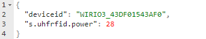

# *WiRIO3 MQTT Base Communication Specification*

# Contents
[Overview](#_toc167371599)

[MQTT Server Setup](#_toc167371600)

[MQTT Topic](#_toc167371601)

[Overview on function of each topic](#_toc167371602)

[JSON Messages on Each Topic](#_toc167371603)

[Communicate Through USB Serial Port](#_toc167371604)

[The Device Peripheral – Core System](#_toc167371605)

[Limitation and Counter Measure of MQTT server](#_toc167371606)

# Overview
## MQTT Communication
The device will communication with the backend host server though a MQTT Broker. For more information on the MQTT Broker working concept, please refer to the link below,

<https://www.hivemq.com/mqtt-essentials/>

<https://www.youtube.com/watch?v=z4r4hIZcp40>

## Device and Peripheral
Each WiRIO3 Device can contain multiple type of Peripheral, e.g., Input Port, Output Port, Environment Sensor, etc.  The host can request for the device properties which also include the Peripheral availability in the device any time by sending a blank JSON packet “ {} “ to the device.

Each Peripheral will have a Peripheral “cmdkey” included as part of the JSON key. This JSON key will be used as the reference name that allow the Host Server to direct send and received RPC or Telematics info to/from the peripheral.

## Type of Attribute
Attribute in the device will include any system properties and peripheral configuration setting in the device. The Attribute is divided in to 2 type/category.

- Device Only Attribute
- Share Attribute
### Device Only Attribute
This type of attribute is only allowing the device to modify and update to the Host Server. Host Server **do not** allow to modify the value of the attribute.

The device will publish any changes on attribute in the Device Publish System Attribute topic.
### Share Attribute
Both the device and the host are allowed to modify the attribute value.
## Communication with the device through MQTT Broker
The WiRIO3 Device and Host Server (backend Management Server) will connect to a MQTT Broker. The device will subscribe to the require topic to listen to any massage published by the Host Server and publish any sensor Telematics information in to the pre-defined MQTT topic.

The Host Server require to subscribe to the device publish topic to listen to the device’s published message and process the sensor data accordingly.

# MQTT Server Setup

|MQTT Broker Connection Type|MQTT TCP/Web-Sock connection with JSON as data packet format|
| :- | :- |
|TCP Port Number|User configurable|
|Encryption|Public CA or Private Certificate, TLS/SSL|

\*\* The server address and port number can be change according to the user requirement using the WiRIO3 Device Configuration Android Apps.

The supported MQTT Topic format are,

- WiRIO3 Topic Format
- User Customizable Topic Format

The selection and configuration of the MQTT Topic can be done by using the WiRIO3 Device Configuration Android Apps.
# MQTT Topic 
In each of the MQTT Topic format selected, there is total of 5 MQTT Topic either for device to publish messages to the server or for device to subscribe the topic in order to listen to any messages from the server.

The 5 MQTT Topic required by the device are as follow,

|*Type of Topic*|*Device*|*Host Server* |
| -: | :- | :- |
|*Telematics Data*|Publish|Subscribe|
|*Device Publish System Attribute*|Publish|Subscribe|
|*Update Device’s System Attribute*|Subscribe|Publish|
|*RPC Request*|Subscribe|Publish|
|*RPC Reply*|Publish|Subscribe|

The default topic setting is as below,

|*Type of Topic*|*WiRIO3 Default*|
| -: | :- |
|*Telematics Data*|W3/<DeviceID>/telemetry|
|*Device Publish System Attribute*|W3/<DeviceID>/attributes|
|*Update Device’s System Attribute*|W3/<DeviceID>/attributes|
|*RPC Request*|W3/<DeviceID>/rpc/request/+|
|*RPC Reply*|W3/<DeviceID>/rpc/response/+|

The <DeviceID> is the unique ID of the device in the format of WIRIO3\_AABBCCDDEEFF where AABBCCDDEEFF is the 6 bytes hex string in upper case. E.g. WIRIO3\_43DF01543AF0.

The “+” wildcard on the RPC request and RPC reply topic will allow the subscriber to receive any topic with other info attached at the end of the topic. For more detail on the MQTT topic wildcard, please refer to the Standard MQTT Broker documentation.
# Overview on function of each topic
## Device Publish System Attribute
The device will publish any system and peripheral attribute setting in this topic. During initial connection to the MQTT Broker, the device will auto publish the all the system and peripheral attributes through this topic. 
## Device Update System Attribute
The device will subscribe to this topic and monitor for any request from the Host Server to update the **share** attributes. If the Host Server require to modify the Share Attribute, the Host Server will publish the request into this topic.
## Telematics Data
The device will use this topic to push the device’s telematics data. The Host Server should monitor this topic for any new sensor information update from the device and process the sensor data accordingly.  
## RPC Request
If the server requires the device to do certain action, the Host Server will publish the request into this topic. On the request message’s topic, Host Server is required to publish the message into the topic with a <RequestID> append at the end of the topic, e.g. W3/<DeviceID>/request/<RequestID>. During the RPC reply, the <RequestID> will be append at the end of the reply message’s topic. The device **will not** do any validation/checking on the <RequestID> value.

Please note that the <RequestID> is compulsory. The system can provide any arbitrary number when publishing the RPC Request.

E.g. 

W3/C45BBE821F38/request/48
## RPC Reply
Once the device received and processed the RPC request from the server, the device will reply to the server through this topic. The <RequestID> on the request message’s topic, will be append to the reply message’s topic.
## Communication Spam Protection
On all the device listening topic (Device Update System Attribute Topic and RPC Request Topic), in combine, the timing between each message must have a minimum gap period of 150ms. Any data packet that has timing gap period that less than this, will be ignore.

# JSON Messages on Each Topic
On the **all the packet sending out from the device**, it will have minimum number of keys as below,

On **all the packet sending to the device** from the back-end server, the minimum number of keys require are the “deviceid” key,

If the “deviceid” do not match the ID of the device, the message will be ignored.

But if the MQTT Topic format selection is either WiRIO3 format, the key “deviceid” is **NOT** required and will be ignore by the device.

Others JSON key that the device published out are as below,

|***Key***|**Description**|
| -: | :- |
|*deviceid*|The unique identifier for each device|
|*sec*|\*\* Current Epoch times in second. (Only available in Telematics Topic)|
|*rssi*|Device Wi-Fi Received Signal Strength Index (Only Available if device is on Wi-Fi Link) |
|*pktno*|A running number increase by 1 when device **publish** a packet on any of the device publish topic|

\*\* The EPOCH time “sec”, only available (in Telematics Topic) if the device is able to obtain the real time clock through the NTP server or Host Server has Updated the “s.sys.epochsec” key and “d.sys.epochvalid” is True. 

The detail NTP server setting and configuration is available in the WiRIO3 Device Configuration Android Apps.

## Device Publish System Attribute
During the device initial connection, it will publish out the all the available system and peripheral attribute. 

The property key listed above starting with “d.xxx.xxx” is Device Only Attribute and not modifiable by the Host Server. If there are any changes on the system attribute, the device will publish it again.

The property key with “s.xxx.xxx” is Share Attribute that can be modify by either device or Host Server (Refer to section “Device Update System Attribute Topic” for further information). 

If the device is having any device peripheral configurable value, the system will publish it together with above attribute.  Below is the example of the Device Published Attribute.

### Example of the system attribute data packet for the peripheral .

Example of a device d.sys.perip attribute indicating that the device is having more than one Peripheral.
### Last Will Message on Device Publish System Attribute Topic
During device initial connection to the MQTT Broker, it will register a Last Will message that will allow the MQTT Broker to publish out when the device is disconnected. The JSON message for the Last Will Message is as below,

### Update Device’s System Attribute
If there is any value that allow the Host Server to modify including the device peripheral setting, the Host Server can publish the key require to modify it in this topic. 

E.g., Change the UHF reader transmission power.

Example of the device response.

If the Host Server send a blank JSON with only the “deviceid” key (for customized MQTT Topic), or total blank JSON packet for WiRIO3 Topic, the device will publish out all the device available attribute in the Device Publish System Attribute Topic.

E.g. Blank request by the host for user customize MQTT Topic. 

E.g., Blank request by the host for WiRIO3.

## Telematics Data
The device will use this topic to publish any telematics data detected by the host. On the detail key/value on the telematics data, please refer to the individual device communication specification for more information.

E.g., Above is a Temperature/Humidity Sensor device publish out the latest temperature and humidity reading.

## RPC Request and RPC Reply
The Host Server can request action on the device’s peripheral that has RPC feature. E.g. Output Port Peripheral.

The host request to set the output port on channel 0 and channel 2 in RPC request topic, 

e.g. 

W3/ WIRIO3\_43DF01547AB1/rpc/request/33 

or 

`	`W3/ WIRIO3\_43DF01547AB1/rpc/request/  (if the <RequestID> is not required).

Once the device has processed the RPC request, it will reply the request in the RPC Response topic, e.g. 

W3/ WIRIO3\_43DF01547AB1/rpc/response/33

If the RCP request is successfully processed, it will return the key/value,

“r.<cmdkey>.result” : true

Else it will return false. 

“r.<cmdkey>.result” : false

In example above, the <cmdkey> is “outputport”.

Please take note that the RPC request is a **blocking process**. The device will only handle the subsequence request after the RPC Reply is published out. Any request received before the device publish the reply message will be directly return with false result.

# Communicate Through USB Serial Port
For the hardware that support serial port communication, user has the option to communication with the device through USB serial port while maintaining the JSON communication format structure.

User can use either Serial Port **OR** MQTT Broker as the JSON communication transport device. Selection can be done using the WiRIO3 Device Configuration Android Apps.

User can only select either using the MQTT Broker **OR** using Serial Port (USB Virtual Comm. Port) for communication. The MQTT Broker will take precedent and disable the Serial Port Communication during device boot up if both of the interface is enabled.
## Serial Port Setting

|*Item*|*Setting*|
| -: | :- |
|*Baud Rate*|115200|
|*Bit Number*|8|
|*Number of Parity Bit*|None|
|*Number of Stop Bit*|1|

## MQTT Topic Conversion
Due to serial communication only has one communication channel, all the topic involved in the MQTT Communication will be converted into JSON object key in the JSON communication packet. The original JSON message will be encapsulated under the topic converted JSON key bracket. List of the MQTT topic conversion is as below,

|*MQTT Topic*|*Convert to JSON Key*|*Direction*|
| -: | :- | :- |
|*Telematics Data*|telematics|From Device|
|*Device Publish System Attribute*|attribute|From Device|
|*Update Device’s System Attribute*|attribute|From Host/Server|
|*RPC Request*|rpcreq|From Host/Server|
|*RPC Reply*|rpcreply|From Device|

 Example of the RPC Request and RPC Reply,

Example of the telematics packet received from the device are as below,

Example of Attribute request,

 

And the Attribute reply.

## Other Differences on MQTT Topic
The other difference between the MQTT Broker vs serial port communication beside the MQTT Topic, is as below,

- <RequestID> are not supported in Serial Communication
- JSON key “rssi” is not available in Serial Communication
- Attribute related with MQTT server or Wi-Fi/Ethernet interface is not relevant, please ignore it.
- JSON key “d.sys.linkup” will always “true”.

# The Device Peripheral – Core System
## System Peripheral

|***Key***|**Value**|
| -: | :- |
|*keycmd*|sys|
### System Only Attribute

|***Key***|**Value Type**|**Description**|
| -: | :- | :- |
|*d.sys.model*|String|
Device Model (TU-04-C04)

|
|*d.sys.name*|String|
Device Name (WiRIO3 IoT Reader)

|
|*d.sys.desc*|String|
Device Description (IoT 4ch UHF RFID Tag Reader)

|
|*d.sys.fwid*|String|
Firmware ID (E.g., 0507-04-EM109R1)

|

|***Key***|**Description**|
| -: | :- |
|*d.sys.addr*|
Device current IP address

|
|*d.sys.iface*|
Device connected interface, either “WiFISTA” for Wi-Fi Link Interface or “ETHERNET” for Ethernet Link Interface

|
|*d.sys.ssid*|
Device Wi-Fi Received Signal Strength Index (Only Available if device is on Wi-Fi Link)

|
|*d.sys.fwid*|
Device Firmware ID (unique for each type of device)

|
|*d.sys.datecode*|
Firmware version Date Code in YYMMDD

|
|*d.sys.model*|
Device model number

|
|*d.sys.name*|
Device Name

|
|*d.sys.desc*|
Device description

|
|*d.sys.perip*|
Available device peripheral in JSON Array. Data in this key will provide detail properties of the available peripheral in the device. Available key under d.sys.perip are as below,

cmdkey : The peripheral  reference ID.

feature : Value that describing the feature of this peripheral. 

|
|*d.sys.linkup*|
True of False to indicate if the device is connected or not connected to the MQTT Broker server.

|
|*d.sys.epochvalid*|
True or false to indicate if the EPOCH time is valid or not valid

|
|*d.sys.rpcbusy*|
Device is busy processing RPC request

|
|
*d.sys.cputemp*

|CPU Temperature in Celcius|
### Share Attribute

|***Key***|**Description**|
| -: | :- |
|*s.sys.epochsec*|
EPOCH time in second. The system Real time clock can be updated by the server through this key.

|
|*s.sys.mqttsenddelay*|Minimum period between 2 consecutive MQTT Packet sending. This is to prevent packet sending too fast causing MQTT broker to drop packet. Value 100~1000 (millisecond).|

### RPC Call and Response

|***Key***|**Value Type**|**Description**|
| -: | :- | :- |
|*r.sys.reboot*|Boolean|
Reboot the device

|

# Limitation and Counter Measure of MQTT server
Due to the nature of the TCP communication protocol used by the MQTT server, and the turnaround time required by the MQTT server to process an incoming TCP packet, a delay between sending two consecutive TCP packets from the device must be provided. 

User can configure the delay period from 100~1000ms by setting the attribute “s.sys.mqttsenddelay”.

` `If the device generates multiple JSON messages between the sending period, the JSON messages will be cached in the device memory until the next sending time slot. All the cached JSON messages will be combined and sent out in one TCP packet.

If the backend Application Server is monitored the topic to received messages from the device, the Application Server will receive multiple JSON messages one big chuck.

For the Application Server to properly Deserialize the JSON messages, the received message must first go through a splitter module to split out the JSON messages one by one and Deserialize it accordingly.

