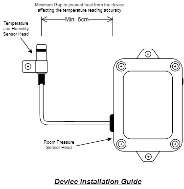

# Quick Setup Guide (EVS-101)

**Industial IoT Temperature/Humidity/Room Pressure Monitoring**

Please install Android App below from Google Play Store to start configuring your device.

[WiRiO3 Device Configurator Google Play Store](https://play.google.com/store/apps/details?id=com.wirio3.wifi_provision)

To quickly setup the device through the android app, please refer link below,

[Device Configuration With WiRiO3 Device Configurator Guide (PDF)](pdf/WiRIO3%20Device%20Configuration%20Manual.pdf)

When Installing the device, please take note of the sensor head placement location

On detail device user guide, see [here](EVS-101 User Guide.md)

For device feature and specification, please refer link below,

[EVS-101 Device Feature and Specification](EVS-101 Device Features.md)

