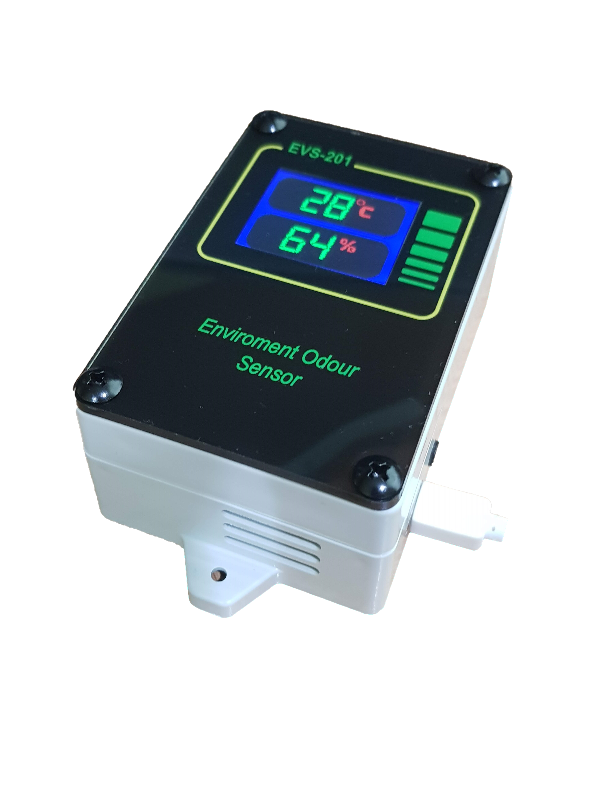
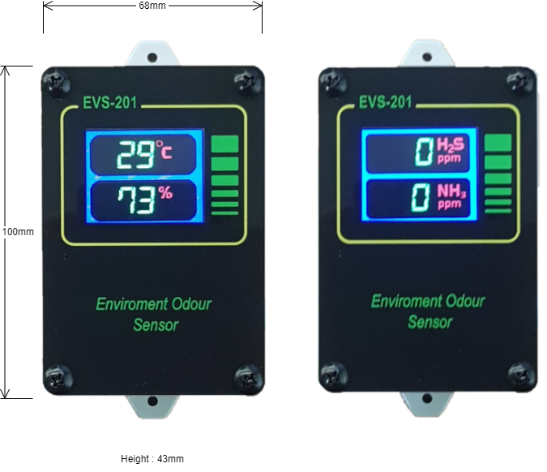

# Industrial IoT Enviroment Sensor

Model Number: EVS-201

Industial IoT Odour Gas Sensor with Temperature/Humidity Monitoring

[Downlod Specification In PDF](pdf/EVS-201%20Product%20Specification%20Rev.1.pdf)

# System Feature

- Connection is from device connected to server.
- Once system power up, it will auto create a persistence connection to the server without user intervention.
- Server can be placed either at public cloud, private cloud or LAN.
- Device able to work behind firewall.

## Network link with MQTT Broker Server

- Open Standard protocol and readily available either using paid version or free version of  MQTT Broker.
- Messaging format based on JSON format.
- JSON messaging format is supported by various programming language and easily integrated to any existing system.
- Device support Secure WebSocket or Secure TCP connection to MQTT Broker.

## Direct link with USB Connection

- The device also can be configured to use USB Connection without connecting to the network.
- Suitable for direct connection with PC/Host system locate beside the device.
- Just add an extra JSON layer of wrapper to wrap around the same JSON messaging standard used in the MQTT Broker Server communication.
- Thus provide an easy path for future system expansion, from localized system architecture to network-based system architecture.

## Auto fetch real time clock from Internet Time Server.

- Auto connect with the Internet Time Server to fetch the Real time value (EPOC Time) when network is connected and internet link is available.
- Manually set time by server if internet link is not available.
- Auto readjust the time drift periodically.
- Append the EPOC time to all the message.

## Easy setup and configuration

- System configures with Android Apps.
- Provide detail device properties, E.g., model number, version number, etc.
- Connectivity selection either using Wi-Fi, Ethernet or USB Link.
- Upload WPA Enterprise Server private/public key.
- Server IP/Domain Name Setup.
- DHCP/Fix IP.
- Internet Time Server Setting.

## Device’s sensors with MEMS

- Build in with Micro-electromechanical systems sensors (MEMS) technology
- Highly accurate and fully digital output direct from the sensors.
- Sensors are calibrated and accuracy are guarantee by sensor manufacturer.

## Other
- Build in with ventilation fan to suck in surround air to have better gas sensing sensitivities.
- Industry grade enclosure for better protection and durability. 

# Hardware Specification
## Power and Enclosure Specification

|Item|Description|
|--|--|
|Input Voltage|DC 5V USB-C Connector  |
|System Power Consumption | 15W Max |
|Operation Humidity|20%-95%RH|
|Operation Temperature|25°C to 45°C|
|Storage Humidity|10-95%RH|
|Storage Temperature|0°C to 85°C|
|Enclosure Dimension |68mm (W) x 100mm (L) x 43mm (H) (Exclude sensor wire and mounting hook, 125mm(L) with mounting hook)|
|Enclosure Type|Durable Industrial ABS and Acrylic Casing with build in ventilation fan|

## Sensors Specification

### Temperature and Humidity

|Item|Description|
|--|--|
|Temperature and Humidity Sensor|Model SHT-Cx By Sensirion|
|Temperature Accuracy|±1°C|
|Relative Humidity Accuracy|2.5%RH|
|Operating Range|0~100%RH, -40~125°C|

### Gas Sensor

|Item|Description|
|--|--|
|NH3 and H2S Gas Sensor|Electrochemical Gas Sensor fully calibrated by sensor manufacture|
|Resolution|1ppm|
|Range|NH3: 0~50PPM, H2S: 0~5000PPM|
|Operating Range|15~90%RH, -20~50°C|
|Initial Start-up Setup Period|Less than 3min|
|Response Period|Less than 30 second|
|Recovery Period|Less than 60 second|

## Wi-Fi Specification

|Item|Description|
|--|--|
|Frequency|	2.4Ghz~2.5Ghz
|Supported Wi-Fi Protocol|	802.11 b/g/n|
|Antenna Type|	Internal|
|Security Protocol|	WPA/WPA2 personal, WPA/WPA2 Enterprise|
|Encryption Protocol|	WEP/TKIP/AES|

## USB Type-C Port Specification

|Item|Description|
|--|--|
|Supported Protocol|USB Virtual Comm Port|
|Baudrate|115200 Baud, 8bit, no-parity, 1 stop bit|

## Backend Server Connectivity

|Item|Description|
|--|--|
|Server Connection|	MQTT Broker with TCP, TCP-TLS, Web-Socket Connection|
|Server Port|User Definable|
|Encryption/Security|Public CA, Self-Signed Certificate|
|Messaging Format|JSON|
|Other|NTP auto RTC update|

## Device Outer Dimension

