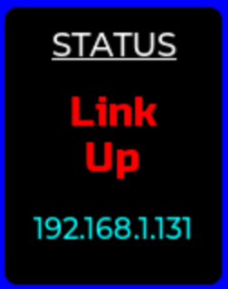
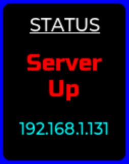

# EVS-201 User Guide

## Power up the device
The device is power up through the USB-C connector. Please connect the device to any USB Charger Adapter or Power supply that able to supply minimum of 5V 1A.

## Network connection option
By default, the device will connect to the network through Wi-Fi Personal or Wi-Fi Enterprise., it will connect to the What-If Cloud server. Please go to the what-if cloud to setup the device into your user account.

To change the device's setting, please go to [here](#ConfigMode) for more information.

## Connecting to the server
After power, the device start the connection process to the server. To view the current connection status, just single click on the Action Button and the display will show current connection status.

If the device currently try to connect to the network (Either though Ethernet or Wi-Fi), it will indicate "Link Down"

When the device successfully connected to the local network and obtain the IP address from DHCP server, it will indicate "Link Up" with the device's IP Address

Once the link is up, the device will try to connect to the Server. Once server connection is successful, it will indicated "Server Up"

Once the server is Up, real time temperature, relative humidity and room pressure data will be updated to the server periodically.

## Configuration Mode

To change the device setting, double click on the Action Button. This display will change to "Config Mode". Use the [WiRiO3 Device Configurator Android Apps](pdf/WiRIO3%20Device%20Configuration%20Manual.pdf) to connect to the device and change the device accordingly. 

To cancel the Configuration Mode and go back to normal operation, just click once on the Action Button and the device will reboot.