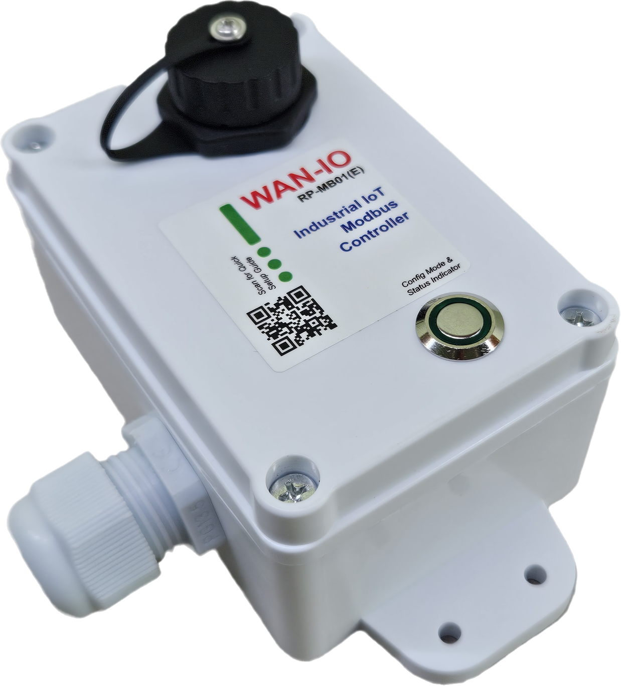
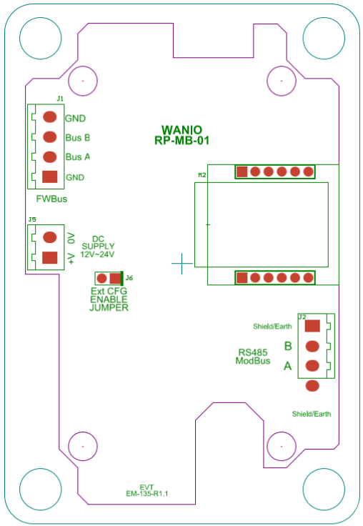

**Dust Resistance Industial IoT Remote Modbus Controller**
[RP-MB01 Device Configuration User Guide](../webconfig2/)

**PCB Connector**

# Device Information
Please refer to link below for the device documentation,

- [RP-MB01E Product Specification](pdf/RP-MB01E%20Product%20Specification%20Rev1.pdf)
- [Wirio3 Base Communication Specification](pdf/WiRIO3%20MQTT%20Base%20Communication%20Spec%20Rev%207.pdf)
- [Wirio3 RP-MB01 Specification](pdf/WiRIO3%20Modbus%20Master%20Controller%20Rev%201.pdf)

**Please take note that to prevent the water/dust to leak into the enclosure, please make sure that the wire going through the wire gland is having outter dimeter between 6.5mm to 11mm (PG13.5).**
