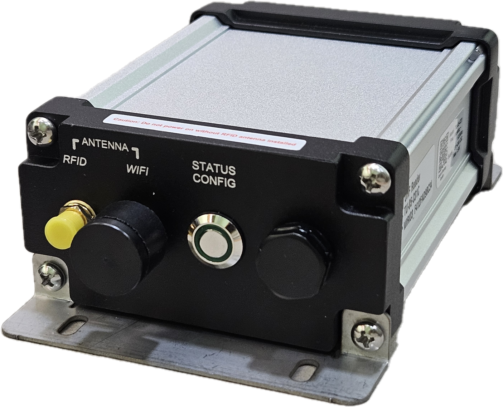

# Quick Setup Guide (TU-05-C01)

**Single Channel Industrial IoT UHF RFID Fix Reader**

## Power Supply

The RFID Reader can be power up either through direct DC power supply or USB Type-C connector.

For direct DC power supply input, the device can support supply voltage range from DC 12V 700mA up to DC 24V 350mA.

As for powering up the device through USB Type-C connected, make sure it is connected to a USB Charger that able to provide up to 7.5W of power supply. 

## Caution
Before power up the device, please make sure that the RFID Antenna in properly connected

## Device Configuration
Please install Android App below from Google Play Store to start configuring your device.

[WiRiO3 Device Configurator Google Play Store](https://play.google.com/store/apps/details?id=com.wirio3.wifi_provision)

To quickly setup the device through the android app, Press the "Status/Config" button once to allow the device to go into configuration mode, 

Once the configuration mode is started, the Link Indicator LED will turn to "Blink-Twice" (Blink twice on each blinking cycle).

<video src="picture/DoubleBlinkIndicator.mp4" width="320" height="240" controls></video>

Further detail on the device configuration using Android App, please refer link below,

[Device Configuration Guide With WiRiO3 Device Configurator (PDF)](pdf/TU-05-C01%20Device%20Configuration%20Manual.pdf)

## Other document
[Device Specification](TU05-Device_Spec.md)

[Device Specification (PDF)](pdf/TU-05-C01%20Product%20Specification%20Rev.1.pdf)

[WiRIO3 Basic Communication Specification](../WiRIO3%20Comm%20Spec/WiRIO3%20MQTT%20Base%20Communication%20Spec/)

[Device Specific Communication Specification](../WiRIO3%20Comm%20Spec/TU05C01/)