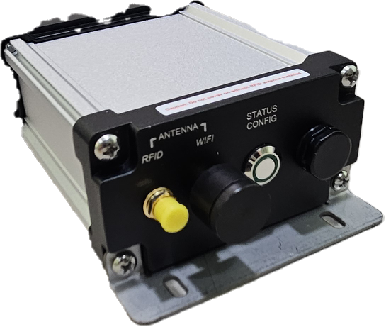

# Device Specification

Model Number: TU-05-C01

[Downlod Specification In PDF](pdf/TU-05-C01%20Product%20Specification%20Rev.1.pdf)
# System Feature

## Wi-Fi/Ethernet Connected UHF RFID Tag Reader

- Connection is from device connected to MQTT server/broker, thus allow the device to place behind firewall.
- Server can be placed either at public cloud, private cloud or LAN.
- Once system power up, it will auto create a persistence connection to the server without user intervention.

## Single Channel Long Range UHF Tag Reading

 - Based on Imping E310 chip with improved read rate and superior receive sensitivity for long rang reading.
 - Build in 1200 Tag Cache size for highspeed reading.
 - Able to match with various type of 50Ω Antenna to manage the tag detection range and angle.
 - User can also adjust the output power from 5dBm to 30dBm to manage the reading distance remotely though the MQTT server/Broker.
 - With the correct antenna and low lost feeder cable, the reader can achieve up to the reading range of 8 meter or more.
 - Build in device core temperature sensor, providing remote temperature monitoring when the device is operating under high temperature environment.
 - Over temperature error auto stop and notification.
 - Build in Tag Selection Filter that only detect the tag that matches or NOT matches the selection criteria.
 - Auto read tag data on any one of the tag’s memories banks when the  tag is detected.
 - Write/Lock/Kill Tag with Tag Selection Filter.

## Water Proofing Aluminium Enclosure

 - Full aluminium enclosure to allow proper heat dissipation during long hour of operation.
 - Water and dust resistance with rubble seal and air vent outlet on the chassis.
 - Water proof ethernet connector with LAN cable water proof cap.

## Internal power supply with DC/DC convertor to reduce power wastage

- DC jack input DC range 12V to 24V, Maximum power consumption 7.5W.
- Power input reverse polarity protection.
- Support supply power through USB Type-C connector

## Auto fetch real time clock from Internet Time Server.

- Auto connect with the Internet Time Server to fetch the Real time value (EPOC Time) when network is connected and internet link is available.
- Manually set time by server if internet link is not available.
- Auto readjust the time drift periodically.
- Append the EPOC time to all the message.

## Direct link with USB Connection

- Easily link up with the device without connecting to the network.
- Suitable for direct connection with PC/Host system locate beside the device.
- Just add an extra JSON layer of wrapper to wrap around the same JSON messaging standard used in the MQTT Broker Server communication.
- Thus provide an easy path for future system expansion, from localized system architecture to network-based system architecture.

## Network link with MQTT Broker Server

- Open Standard protocol and readily available either using paid version or free version of MQTT Broker Server.
- Messaging format based on JSON format.
- JSON messaging format is supported by various programming language and easily integrated to any existing system.

## Easy setup and configuration

- System configures with Android Apps.
- Provide detail device properties, e.g. model number, version number, etc.
- Connectivity selection either using Wi-Fi, Ethernet or USB Link.
- Server IP/Domain Name Setup.
- DHCP/Fix IP.
- Internet Time Server Setting, once enable, all the telematics packet will included with EPOC time (in second only).

# Hardware Specification
## Power and Enclosure Specification

|Item|Description|
|--|--|
|Input Voltage|DC 12V to 24V or USB Type-C 5V  |
|Supported POE|IEEE802.af/at, RJ45 Connector Power pin on 1&2, 3&6 and 4&5, 7&8.|
| System Power Consumption | 7.5W Max |
|Operation Humidity|20%-90%RH|
|Operation Temperature|25°C to 45°C|
|Storage Humidity|10-95RH|
|Storage Temperature|0°C to 85°C|
|Enclosure Dimension |92mm (W) x 116mm (L) x 47mm (H) Excluding Connector and Mounting Bracket, 92mm (W) x 150mm (L) x 51mm (H) Including Connector and Mounting Bracket with 4x Mounting Hole|
|Enclosure Type|Water Proof Aluminum Extrusions|

## RFID Reader Specification

|Item|Description|
|--|--|
|Antenna Channel|	1 Channel|
|Operation Frequency|	919MHz~923MHz Auto Hopping (According to MCMC Class Assignment for RFID)|
|Output Power|	30dBm Max, User Adjustable in 1dBm Step|
|UHF Tag Protocol|	EPC global UHF Class 1 Gen 2 ISO 18000-6C|

## Wi-Fi Specification

|Item|Description|
|--|--|
|Frequency|	2.4Ghz~2.5Ghz
|Supported Wi-Fi Protocol|	802.11 b/g/n|
|Antenna Type|	External|
|Security Protocol|	WPA/WPA2 personal|
|Encryption Protocol|	WEP/TKIP/AES|

## Ethernet Specification

|Item|Description|
|--|--|
|Speed|	RJ45, 10/100 Mbps|

## USB Type-C Port Specification

|Item|Description|
|--|--|
|Supported Protocol|	USB Virtual Comm Port
|Baud Rate|	921600 Baud, 8bit, no-parity, 1 stop bit

## Backend Server Connectivity

|Item|Description|
|--|--|
|Server Connection|	MQTT Broker with TCP, TCP-TLS, Web-Socket Connection|
|Server Port|	User Definable|
|Encryption/Security|	Public Certificate/SSL|
|Messaging Format|	JSON|
|Other|	NTP auto RTC update|

