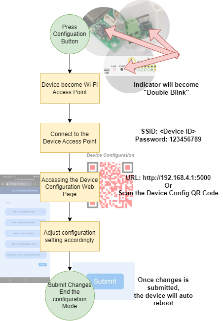
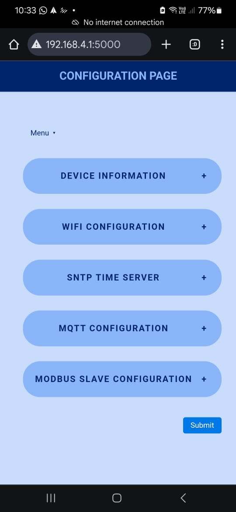
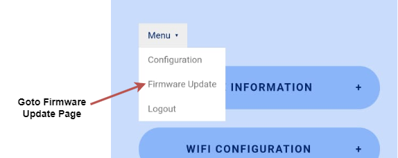
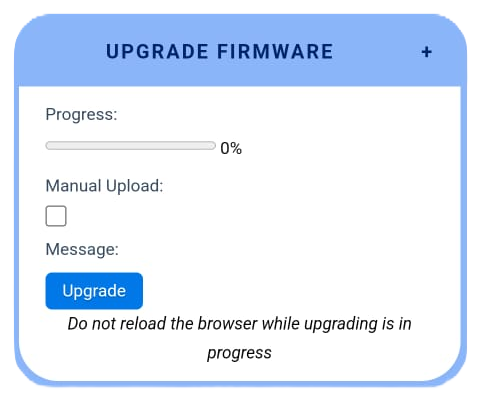
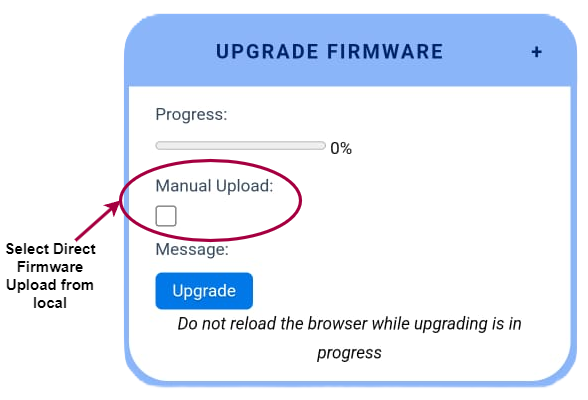
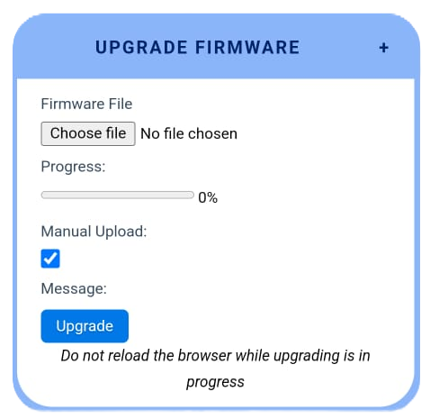

# Device Configuration Mode

The device setting can be changed when the device is under Configuration Mode. To place the device under Configuration Mode, please follow the step listed as below,

When the device is under configuration mode, the indicator will show "Double Blink" status.

<video src="picture/DoubleBlinkIndicator.mp4" width="320" height="240" controls></video>

To connect to the device configuration webpage after connected into the device Access Point, please input URL below or scan the configuration QR code on the device.

URL: http://192.168.4.1:5000

Below is the example device setting web page when the device is under Configuration Mode,

User can change the device setting through this web page. Once all the changes is done, click on the "Submit" button and the new setting will be saved into the device. The device will auto reboot after that.

# Firmware Upgrade

The firmware on the device can be upgraded when there is new firmware release.

The device support 2 mode of firmware upgrade,
 - Direct download and upgrade the firmware throught he Firmware Server.
    - To allow the firmware to be download from the Firmware Server, the device must be connected to local network (Either though Wi-Fi or Ethernet) that provided the internet access **BEFORE** the device enter into the configuration mode.
 - Upload the firmware directly from local PC's web browser.

## Accessing the Firmware Upgrade Web Page
Set the device into configuration mode according to step describe above, Click on the "Firmware Update" Link,

### Firmware update directly from Firmware Server
On the Upgrade Firmware dialog box, click on the "Upgrade" button and follow the instruction accordingly. Once upgrade is done, the device will auto reboot.

### Direct upload the firmware from web browser
On the Upgrade Firmware dialog box, click "Manual Upload" check box and select the Firmware file to upload,

Select the file and click on the "Upgrade" button. Follow the instruction, once upgrade is done, the device will auto reboot.
