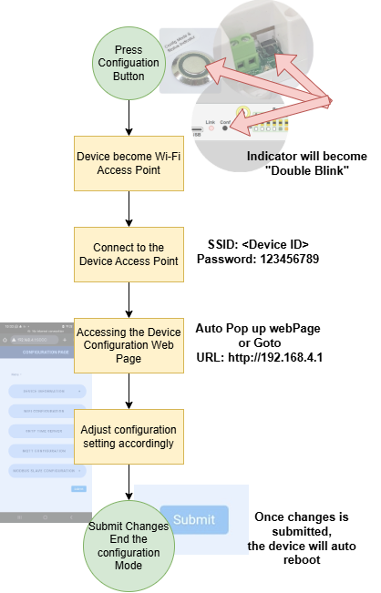
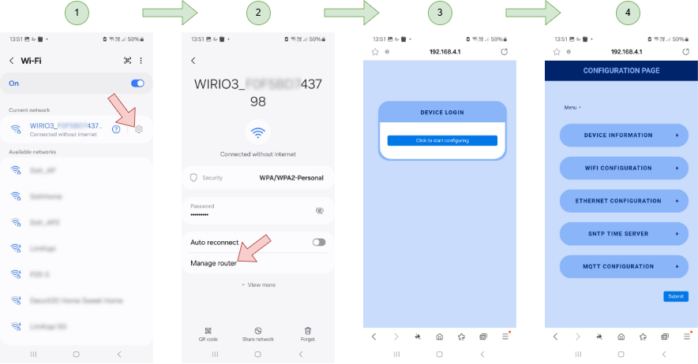
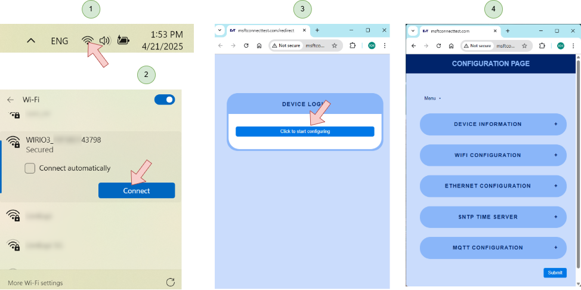
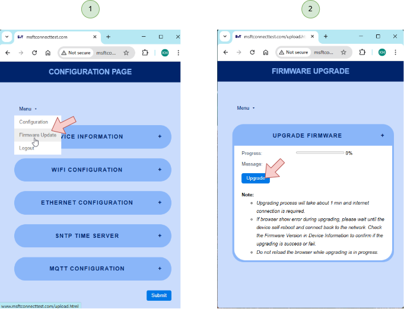

# Device Configuration Mode

The device setting can be changed when the device is under Configuration Mode. To place the device under Configuration Mode, please follow the step listed as below,

When the device is under configuration mode, the indicator will show "Double Blink" status.

<video src="picture/DoubleBlinkIndicator.mp4" width="320" height="240" controls></video>

User can use mobile phone or Laptop PC to configure the device.

# Device Configuration with Mobile Phone

User can use mobile phone to do the device configuration.

1. Connect to the device's MacID using the Wi-Fi connection with Wi-Fi Password "123456789". Once connected, click on the setup icon.
2. Click on the "Manage router" to start the configuration.
3. A browser windows will pop-up. Proceed to the configuration page.
4. Click on the listed tab at the page to change the setting. Once done, click "Submit" to save the setting. Once saved, the device will auto reboot into the new setting.

# Device Configuration with Laptop PC
To user Laptop PC to configure the device,

1. Click on the Wi-Fi logo on the lower write conner of you PC screen.
2. Connect to the device MacID using the Wi-Fi Connection with Wi-Fi Password "123456789".
3. Once the device is connect, the configuration Webpage will auto Pop-Up. User can also click on the "Open browser and connect" in the Wi-Fi connection dialog box if the windows did not auto pop-up. Proceed to the configuration page.
4. Click on the listed item to change the setting. Once done, click "Submit" to save the setting the and device will auto reboot into the new setting.

# Firmware Upgrade

The firmware on the device can be upgraded when there is new firmware release.

The device will direct download the lastest firmware from Firmware Server.

Please make sure the device is already able to connect to the internet before setting the device to go into configuration mode.

## Accessing the Firmware Upgrade Web Page
Set the device into configuration mode according to step describe above, Click on the "Firmware Update" Link,

1. After the mobile phone/Laptop PC connected to the device, under the configration page, select "Firmware Upgrade"
2. In the "Firmware Upgrade" Page, click the "Upgrade" button to start the upgrade process.

Note:
During the firmware upgrade process, if error occour halfway during upgrading the device, please allow the device to continue the upgrading process until the device has self restarted. 

After that, connect the device under configuration mode and check the firmware version indicated under the "Device Information" tab to confirm if the upgrading process is success of not.

